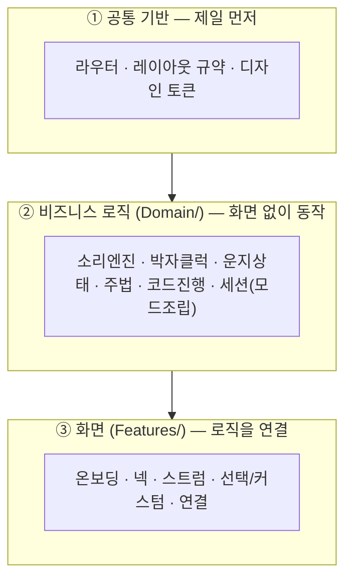
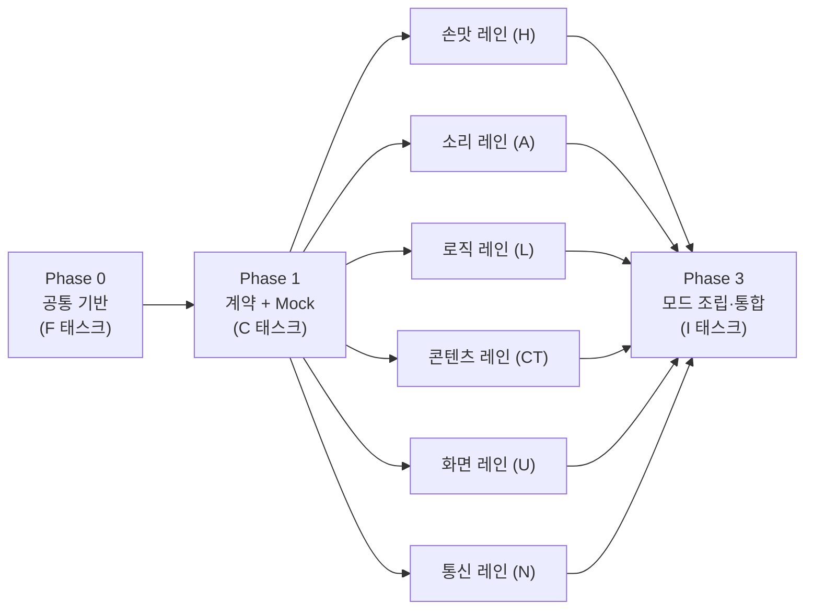
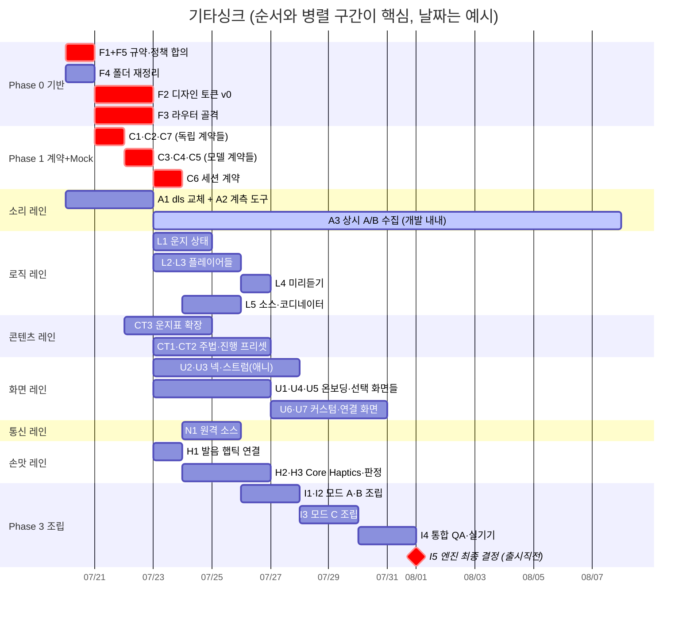

# 🗺️ 기타싱크 로드맵 & 태스크 보드 — "무슨 순서로" 만드나

> **문서 3형제:** [SPEC.md](SPEC.md)(무엇을) · [ARCHITECTURE.md](ARCHITECTURE.md)(어떻게) · **ROADMAP.md(무슨 순서로 — 지금 이 문서)**
>
> **처음 온 팀원의 읽기 순서:** ① 이 문서 §1(원칙) → ② SPEC 전체(15분) → ③ 이 문서 §4에서 태스크 훑기 → ④ 자기가 맡을 태스크의 "관련 계약"만 ARCHITECTURE에서 찾아 읽기. **끝.**
>
> 차트는 GitHub 웹에서 열어야 그림으로 보입니다. 일 분배는 아직 안 정했습니다 — **여기서는 "무슨 일이 있고 어떤 순서인지"만** 정리합니다. 분배는 이걸 보고 회의에서.

---

## 1. 두 가지 원칙 (전부를 관통함)

### 원칙 1 — 계약(껍데기) 먼저, 그다음 각자

> "이런 기능이 이렇게 들어오고 나온다"는 **껍데기 약속(계약)**을 먼저 정하고, 각자는 그 껍데기만 보고 동시에 만든다. 콘센트 규격만 맞으면 어떤 가전이든 꽂히는 것처럼, 마지막에 딸깍 붙는다.
> 그리고 **계약을 만들 때 Mock(가짜 대역)도 같이** 만든다 — 그래야 상대가 완성되기 전에 내 것을 개발할 수 있다. ([ARCHITECTURE §4](ARCHITECTURE.md#4-병렬-개발이-실제로-어떻게-돌아가나))

### 원칙 2 — 로직과 화면(UI)은 분리

> "짚으면 소리 난다", "리듬대로 자동으로 긁는다" 같은 **규칙(비즈니스 로직)은 화면 없이 혼자 돌아가게** 만들고(`Domain/`), 화면 담당은 그걸 **가져다 연결**한다(`Features/`). 로직 만드는 사람과 화면 만드는 사람이 같을 필요가 없고, 서로 기다릴 필요도 없다.

---

## 2. ⏳ 소리 엔진은 일부러 "아직" 안 고른다

Native(AVAudioEngine)와 AudioKit **둘 다 계약(`GuitarAudioEngineProtocol`) 뒤에 살려둔 채**, 개발 내내 실기기에서 메모리·발열 데이터를 쌓다가 **최종 결정은 출시 직전(가장 늦게)** 내립니다. 데이터가 가장 많을 때 고르는 게 제일 정확하니까요.

- 지금 안 정해도 **다른 개발은 하나도 안 막힙니다** — 모두 계약에만 기대고 있어서.
- 두 엔진 다 이미 완성돼 있고, 디버그 버튼으로 **런타임 즉시 교체**됩니다.
- 진 엔진 파일 정리는 **출시 직전에만** (태스크 I5).

---

## 3. 전체 흐름 한눈에

- **Phase 0**: 전원이 쓰는 기반. 짧고 굵게.
- **Phase 1**: 계약 7개를 껍데기+Mock으로. **각각 반나절~1일짜리 — 여기에 시간 끌지 않기.**
- **Phase 2**: 6개 레인이 **동시에** 달림. 레인끼리는 계약으로만 만나므로 안 부딪힘.
- **Phase 3**: 플러그를 꽂아 모드 A→B→C 순서로 조립·검증.

---

## 4. 태스크 목록 ★분배 회의는 이 표로

크기: **S** = 반나절 안팎 · **M** = 1~2일 · **L** = 3일 이상.
"관련 계약"의 §번호는 [ARCHITECTURE.md](ARCHITECTURE.md)의 절 번호. **자기 태스크의 관련 계약 절만 읽으면 됩니다.**

> ## ✅ 진행 상황 (2026-07-20)
> **Phase 0·1 완료 → Phase 2 착수.** F·C 태스크는 끝났고, 6개 레인이 동시에 출발 가능한 상태입니다.
> 시뮬레이터 빌드 통과 확인 완료.
>
> **Phase 0에서 아직 안 끝난 것 2개** (다른 작업을 막지는 않음):
> - **F2 — 여백만 임시값**: 색·글자·레이아웃은 Figma HI-FI 실제 값으로 확정했고, `SpacingTokens.swift`(Spacing·Radius)만 기존 코드에서 역산한 임시 눈금입니다. Figma 여백 스펙 확보 후 **이 파일의 숫자만** 교체하면 됩니다.
> - **F5 — 팀 승인 대기**: 온보딩 정책은 문서상 확정, 회의 승인만 남았습니다.
>
> **Phase 2 진행분**: U7(연결 가이드·기기 찾기) 초안 완료 · A4(오디오 세션 안정성) 구현 완료·실기기 검증 대기. 나머지 레인은 미착수입니다.

### Phase 0 — 공통 기반 (F) — ✅ 완료

| ID | 태스크 | 하는 일 | 산출물 | 선행 | 크기 |
|----|--------|--------|--------|------|------|
| F1 | 레이아웃 규약 확정 | 지원 기기(iPhone/iPad)·방향(가로 고정)·반응형 vs 고정·기준 해상도를 **한 페이지로 합의** (기존 `PortraitLockedLandscapeStage` 방식 공식화 여부 포함) | 결정문 (ARCHITECTURE에 추가) | — | S |
| F2 | 디자인 토큰 v0 | Figma '디자인 스타일'의 색·여백·글자를 `DesignSystem/Tokens/`로. **Figma HI-FI 화면명 ↔ SPEC §6 화면표 1:1 맞추기 포함** | Tokens 파일들 | Figma 접근 | M |
| F3 | 라우터 골격 | `AppRoute`(화면 9개 전부) + `AppRouter` + **모든 화면의 빈 껍데기** 등록 → 누구든 자기 화면 파일만 채우면 되는 상태 | App/AppRouter.swift + 빈 화면들 | F1 | M |
| F4 | 폴더 재정리 | ARCHITECTURE §2 구조대로 기존 파일 이사 (**한 사람이 1회에**) | 새 폴더 구조 | — | S |
| F5 | 온보딩 정책 승인 | SPEC §플로우4 표(볼륨=안내+슬라이더, 방해금지=안내만)를 팀이 승인 | SPEC 확정 | — | S |

### Phase 1 — 계약 + Mock (C) — ✅ 완료 ※산출물 = 껍데기 + Mock 1개 + 사용 예시 주석

| ID | 태스크 | 하는 일 | 관련 계약 | 선행 | 크기 |
|----|--------|--------|----------|------|------|
| C1 | 박자 클럭 계약 | `BeatClockProtocol` + 기본 구현 + Mock | §3.2 | — | S |
| C2 | 코드 카탈로그 계약 | `GuitarChord` 확장 틀 + 조회 API (데이터는 CT3가 채움) | §3.3 | — | S |
| C3 | 운지 상태 계약 | `FretPress`·`pressesChanged`·`notePlayed`·발음 정책 | §3.4 | C2 | S |
| C4 | 스트럼 패턴 계약 | `StrumPattern`·`StrumStep`·Library + Mock 프리셋 3개 | §3.5 | C1 | S |
| C5 | 코드진행 계약 | `ChordProgression`·Library·Preview 계약 + Mock | §3.6 | C1, C2 | S |
| C6 | 세션(모드) 계약 | `FingeringSource`·`StrumSource`·`PlaySessionCoordinator`·`PlayMode` | §3.7 | C3~C5 | M |
| C7 | 연결 플로우 계약 | `PeerRolePolicy`(iPad=스트로크 고정)·`ConnectionFlowState`·가이드 스킵 플래그 | §3.8 | — | S |

### Phase 2 — 병렬 구현 (6개 레인 동시)

**🎵 소리 레인 (A)** — Phase 0·1과 무관, **오늘부터 가능**

| ID | 태스크 | 하는 일 | 관련 계약 | 선행 | 크기 |
|----|--------|--------|----------|------|------|
| A1 | 사운드폰트 통일 | `gs_instruments.dls` 확보 → 두 엔진 모두 이걸 로드 (지금은 `AcousticGuitar.sf2`) | §3.1 | — | S |
| A2 | 성능·지연 계측 도구 | 메모리·CPU·발열(`thermalState`) + **터치→소리 지연(latency)** 을 자동 기록 (지연은 악기 앱 1순위 지표) | §3.1 | — | M |
| A3 | 상시 A/B 데이터 수집 | 개발 내내 실기기에서 두 엔진 데이터 축적 (§2 정책) | §3.1 | A1, A2 | 지속 |
| A4 | 오디오 세션 안정성 | 전화·이어폰·Siri·블루투스 등 중단/경로변경 시 엔진 복구(`AVAudioSession` 알림). **안 하면 실사용 중 소리가 죽음** | §3.1.1 | — | ✅ 구현 완료 · 실기기 검증 대기 |

> **A4 실기기 검증 체크리스트** — `AudioSessionController`는 **시뮬레이터로 검증이 안 됩니다.** 실기기에서 아래 5개를 직접 해보고, 매번 *다시 소리가 나는지* 확인하세요. 디버그 빌드는 `[AudioSession]` 로그를 찍습니다.
>
> 1. 연주 중 **전화 받기** → 끊고 앱 복귀
> 2. 연주 중 **Siri 호출** → 닫기
> 3. **유선 이어폰 뽑기** (소리가 스피커로 갑자기 커지면 안 됨) → 다시 꽂기
> 4. **블루투스 이어폰 연결/해제**
> 5. 홈으로 나갔다 **한참 뒤 복귀** (중단 종료 알림을 놓치는 경로)
>
> ⚠️ 미디어 서비스 리셋은 인위적 재현이 어렵습니다 — 코드 경로만 리뷰로 확인하고 넘어갑니다.

**🧠 로직 레인 (L)**

| ID | 태스크 | 하는 일 | 관련 계약 | 선행 | 크기 |
|----|--------|--------|----------|------|------|
| L1 | 운지 상태 구현 | 멀티터치 → 운지 갱신 + 개별 발음(`pluckOnPress`) + `notePlayed` 방송 | §3.4 | C3 | M |
| L2 | 스트럼 플레이어 | 패턴을 클럭에 맞춰 자동 연주 (모드 A의 자동 오른손) | §3.5 | C4 | M |
| L3 | 진행 플레이어 | 진행을 클럭에 맞춰 자동 운지 (모드 B의 자동 왼손) | §3.6 | C5 | M |
| L4 | 미리듣기 플레이어 | 기본 주법·BPM으로 재생, 동시 재생 방지 | §3.6 | C5, L2 | S |
| L5 | 소스·코디네이터 구현 | Manual/Auto 소스들 + 코디네이터 (모드 A·B가 여기서 성립) | §3.7 | C6, L1~L3 | M |

**📚 콘텐츠 레인 (CT)** — 코드 작성 최소, **리서치가 본체.** 개발이 부담스러운 팀원에게 적합

| ID | 태스크 | 하는 일 | 관련 계약 | 선행 | 크기 |
|----|--------|--------|----------|------|------|
| CT1 | 주법 프리셋 입력 | 초보자용 스트로크 리듬 리서치(칼립소·고고 등) → `StrumStep` 표로 입력 | §3.5 | C4 | M |
| CT2 | 진행 프리셋 입력 | 머니코드(C→G→Am→F)·캐논 등 리서치 → 데이터 입력 | §3.6 | C5, CT3 | M |
| CT3 | 운지표 확장 | 프리셋 진행에 필요한 코드들의 운지 조사 → 카탈로그 입력 (뮤트 -1 규약 준수) | §3.3, §5 규약 | C2 | M |

**🖼️ 화면 레인 (U)** — 전부 F2(토큰)+F3(라우터) 이후, **Mock으로 로직 안 기다리고 개발**

| ID | 태스크 | 하는 일 | 관련 계약 | 선행 | 크기 |
|----|--------|--------|----------|------|------|
| U1 | 온보딩 화면 | 첫 실행 안내, 볼륨 카드(슬라이더), 방해금지 안내 | §3.10 | F2, F3, F5 | M |
| U2 | 기타넥 화면 | HI-FI + **멀티터치 → `FretPress` 방출** + 짚힌 자리 표시 (**iPhone 전용**) | §3.4 | F2, F3, C3 | ✅ 구현 완료 · 실기기 검증 대기 |

> **U2 실기기 검증 체크리스트** — **멀티터치는 시뮬레이터로 검증이 안 됩니다.** 마우스는 손가락 하나뿐이고, Option 키 조합은 핀치 제스처라 임의의 동시 터치를 만들 수 없습니다. 아래는 실기기에서만 확인됩니다.
>
> 1. **한 손가락**으로 아무 칸이나 누르기 → 그 자리에 점이 찍히고 **즉시 소리**
> 2. **세 손가락으로 C코드 짚기**(5번줄 3프렛·4번줄 2프렛·2번줄 1프렛) → 점 3개 + **화음**
> 3. 손가락을 **누른 채 옆 칸으로 밀기** → 점이 따라오고 새 칸 소리
> 4. 짚은 채로 **다른 손가락 추가/제거** → 나머지는 계속 짚힌 상태로 유지
> 5. 같은 줄에 손가락 2개 → **높은 프렛만** 울림 (실제 기타와 동일)
> 6. 위쪽 **컨트롤 바를 눌러도 소리가 안 나야** 함 (지판 밖 터치는 무시)
>
> ⚠️ 렌더링·좌표는 시뮬레이터로 확인 완료. 남은 건 **터치 입력**뿐입니다.
| U3 | 스트럼 화면 + 줄 애니메이션 | HI-FI + `notePlayed` 구독 → **줄 떨림·세기별 진폭/글로우**. ⚠️**iPhone·iPad 레이아웃 2종** (Figma `iPad Pro 12.9" - 3/4/5` 참고, 비율이 달라 늘리면 안 됨) | §3.4, §3.7 | F2, F3, C3 | L |
| U4 | 스트로크 선택 화면 | 프리셋 목록 → 선택·확정 (**커스텀 없음** · iPhone 전용) | §3.5 | F2, F3, C4 | ✅ 완료 (CT1 데이터 대기) |

> **U4 메모** — 화면은 끝났고 **남은 건 데이터뿐**입니다.
> - 목록·악보 기호가 전부 `StrumPresetData`에서 계산돼 나오므로, **CT1이 주법을 추가하면 화면은 한 줄도 안 고쳐도** 항목이 늘어납니다.
> - 박자 필터 칩(`ALL / 4/4 / 3/4 / 6/8`)은 **데이터에 실제로 있는 박자만** 나옵니다. 지금은 프리셋 2개가 모두 4/4라 칩 줄이 숨겨져 있고, CT1이 3/4·6/8을 넣으면 저절로 나타납니다.
> - HI-FI의 카드 오른쪽 **드래그 핸들(≡)은 뺐습니다** — 주법 커스텀·재정렬이 범위에서 빠져(2026-07-20) 동작할 게 없는 장식이라서입니다. 되살릴지는 디자인 확인 필요.
| U5 | 진행 선택 화면 | 프리셋 진행 목록 → 선택·확정 | §3.6 | F2, F3, C5 | M |
| U6 | 진행 커스텀 화면 | 카탈로그에서 코드 배치 + **미리듣기** + 결정 | §3.6 | F2, F3, C5 (미리듣기 완성엔 L4) | L |
| U7 | 연결 플로우 화면 | 가이드(스킵 가능) + 근처 기기 찾기 + 권한 팝업 예고 | §3.8 | F2, F3, C7 | ✅ 초안 완료 |

**📡 통신 레인 (N)**

| ID | 태스크 | 하는 일 | 관련 계약 | 선행 | 크기 |
|----|--------|--------|----------|------|------|
| N1 | 원격 소스 구현 | 수신 메시지를 `RemoteFingeringSource`/`RemoteStrumSource`로 포장 + 역할 고정 적용 | §3.7, §3.8 | C6, C7 | M |

**🫨 손맛·접근성 레인 (H)** — 음성 명령을 뺀 뒤 **접근성의 주인공**. U3(줄 애니메이션)와 같은 이벤트를 먹으므로 짝으로 개발

| ID | 태스크 | 하는 일 | 관련 계약 | 선행 | 크기 |
|----|--------|--------|----------|------|------|
| H1 | 발음 햅틱 연결 | `notePlayed`/`strumPerformed` → 세기별 햅틱. `HapticsManager` **이미 있음, 연결만** | §3.11 | C3, C4 | S |
| H2 | Core Haptics 감쇠 | `UIImpactFeedbackGenerator` → `CHHapticEngine` 승격. 연속 이벤트 + 강도 감쇠 곡선으로 "줄이 잦아드는" 진동 | §3.11 | H1 | M |
| H3 | 판정 햅틱 | 목표 코드 vs 현재 운지 비교 → 틀리면 강한 진동. 적용 범위는 SPEC §8 결정 대기 | §3.11, §3.3 | C3, H1 | M |
| H4 | 접근성 전반 | VoiceOver 라벨 · 다이내믹 타입 · 모션 줄이기 대응 | — | U1~U7 | M |

### Phase 3 — 조립·통합 (I)

| ID | 태스크 | 하는 일 | 선행 | 크기 |
|----|--------|--------|------|------|
| I1 | 모드 A 조립 | 넥에서 짚기 × 자동 주법 → 실기기 검증 | L1, L2, L5, U2, U4 | S |
| I2 | 모드 B 조립 | 자동 진행 × 직접 긁기 → 실기기 검증 | L3, L5, U3, U5, U6 | S |
| I3 | 모드 C 조립 | iPhone 짚기 × iPad 긁기 → 두 기기 검증 | N1, U7, I1, I2 | M |
| I4 | 통합 QA | 전 화면 디자인 점검 + 실기기 발열/성능 + **햅틱·접근성 실사용 검증** + 엣지 케이스(SPEC §8 결정 반영) | I1~I3, H2 | M |
| I5 | **엔진 최종 결정** ⏳ | A3 데이터(**지연·메모리·발열 종합**)로 Native vs AudioKit 판정 → 진 쪽 파일 정리 (**출시 직전**) | A3, I4 | S |

---

## 5. 간트차트 (기간은 예상 — 팀 일정에 맞게 조정)

**글자로만 보일 때 읽는 법:** 기반(F) 며칠 → 계약(C) 이틀 안에 몰아서 → 그 순간부터 **소리/로직/콘텐츠/화면/통신/손맛 6개 레인이 동시에** → 끝에서 모드 A→B→C 순서로 조립 → 맨 마지막에 엔진 결정.

---

## 6. 서로 안 부딪히는 협업 규칙 (git)

- 🌱 `develop`에서 **태스크 단위 브랜치**: `feature/태스크ID-이름` (예: `feature/C4-strum-pattern`, `feature/U3-strum-screen`)
- 🚫 `main`/`develop` 직접 커밋 금지 — 항상 브랜치 → PR
- 🧩 레인이 다르면 폴더도 다르게 설계돼 있음(ARCHITECTURE §2) → 충돌 최소
- 🔁 시작 전 `develop` `pull`, 자주 `push`
- 📢 **계약 파일 변경 = 팀 공지 + ARCHITECTURE.md 갱신** (모두의 껍데기라 영향 큼)

---

## 7. 용어 사전

| 용어 | 쉬운 뜻 |
|------|--------|
| **계약 / 인터페이스 / 프로토콜** | "이런 기능이 이렇게 들어오고 나온다"고 미리 정한 **껍데기**. 속은 각자 자유 |
| **Mock(목)** | 계약은 지키지만 속은 가짜인 **대역 배우**. 상대 완성 전에 내 것 개발 가능 |
| **비즈니스 로직** | 화면 없이 도는 **규칙** (소리·리듬·진행) — `Domain/` 폴더 |
| **소스(Source)** | "지금 왼손이 뭘 짚나 / 오른손이 언제 긁나"를 공급하는 **플러그**. 직접/자동/원격 3종 |
| **코디네이터** | 왼손 플러그와 오른손 플러그를 꽂아 소리로 만드는 **멀티탭 본체** |
| **라우팅 / 라우터** | 화면 이동 규칙 / 그걸 한 곳에서 관리하는 **안내데스크** |
| **디자인 토큰** | 색·여백·글자에 **이름 붙인 것**(`Spacing.md=16`). 숫자 직접 쓰기 금지 |
| **운지(핑거링)** | 왼손이 어느 줄 몇 프렛을 짚고 있는지. `-1`=뮤트, `0`=개방현 |
| **폴리포니** | 여러 음이 **동시에** 울리는 것 (화음) |
| **박자 클럭** | BPM대로 "몇 마디 몇 박째"를 방송하는 **메트로놈 심장** |
| **스트럼 패턴 / 주법** | 오른손 리듬 하나 (어떤 박에 ↑/↓, 세기) — 데이터로 표현 |
| **코드진행** | 코드가 바뀌는 순서 (머니코드 C→G→Am→F 등) |
| **미리듣기** | 선택 전에 짧게 들어보기. **한 번에 하나만** 재생 |
| **카운트인** | 연주 시작 전 "하나 둘 셋 넷" 예고 (도입 여부 미정 — SPEC §8) |
| **스파이크** | 본격 개발 전에 "이게 기술적으로 되나?"만 빨리 실험하는 짧은 검증 작업 |
| **햅틱** | 손끝에 주는 진동 피드백. 튕김·오류를 손으로 느끼게 함 — **접근성의 주인공** |
| **Core Haptics** | 진동의 세기를 **곡선으로** 그릴 수 있는 프레임워크. "서서히 잦아드는" 진동은 이걸로만 가능 |
| **velocity(세기)** | 얼마나 세게 튕겼나 (0~127). 소리 크기 + 시각 효과에 사용 |
| **thermalState(발열)** | 기기 온도 상태값 — 엔진 비교의 핵심 지표 |
| **로컬 네트워크 권한** | 기기끼리 연결할 때 iOS가 띄우는 허용 팝업 (첫 1회) |
| **브랜치 / PR** | 코드의 평행세계 / "합쳐주세요" 요청 + 코드 리뷰 |

---

### 관련 문서
- 제품 명세(모드·플로우·화면·온보딩 제약) → [SPEC.md](SPEC.md)
- 폴더 구조·계약 카탈로그·병렬 방법 → [ARCHITECTURE.md](ARCHITECTURE.md)
- 왜 이 기술을 골랐나 → `docs/adr/` · 오디오 동작 원리 → `docs/tech-notes/audio-pipeline.md`
