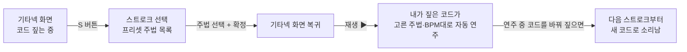
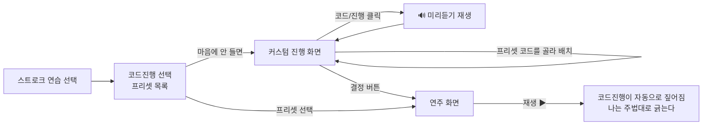
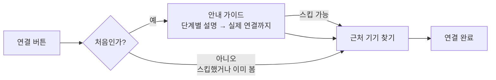

# 🎯 기타싱크 제품 명세 (SPEC) — "무엇을" 만드나

> **문서 3형제:** [SPEC.md](SPEC.md)(무엇을) · [ARCHITECTURE.md](ARCHITECTURE.md)(어떻게) · [ROADMAP.md](ROADMAP.md)(무슨 순서로)
> 이 문서는 구두로 논의된 기획을 정리한 것입니다. **기획이 바뀌면 이 문서부터 고치세요.** 어려운 용어는 [ROADMAP.md의 용어 사전](ROADMAP.md#용어-사전) 참고.

---

## 1. 한 문장 정의

**아이폰(왼손·코드 짚기)과 아이패드(오른손·스트로크)가 한 대의 기타가 되어, 기타 없이 진짜 기타 연주를 경험하는 앱.** 한 대만으로도 연습할 수 있습니다.

---

## 2. 핵심 설계 아이디어 — "기타 연주 = 왼손 × 오른손"

기타 연주는 언제나 딱 두 가지의 조합입니다.

- **왼손(운지)** — 지금 어떤 코드를 짚고 있나
- **오른손(스트로크)** — 언제, 어느 방향으로, 얼마나 세게 긁나

우리 앱에서 각 손은 **3가지 방식** 중 하나로 채워집니다.

| 방식 | 왼손(운지)이라면 | 오른손(스트로크)이라면 |
|------|----------------|---------------------|
| 🖐️ **직접** | 기타넥 화면을 손가락으로 짚는다 | 줄 화면을 손가락으로 긁는다 |
| 🤖 **자동** | 정해둔 코드진행이 시간 따라 자동으로 짚어진다 | 고른 주법(리듬 패턴)이 박자 따라 자동으로 긁는다 |
| 📡 **원격** | 연결된 아이폰이 짚은 걸 실시간으로 받는다 | 연결된 아이패드가 긁은 걸 실시간으로 받는다 |

그래서 **모든 모드는 이 조합표 하나로 설명됩니다.**

| 모드 | 왼손 | 오른손 | 한 줄 설명 |
|------|------|--------|-----------|
| **A. 코드 연습** | 🖐️ 직접 | 🤖 자동 | 내가 짚은 코드가, 내가 고른 주법대로 자동으로 쳐진다 |
| **B. 스트로크 연습** | 🤖 자동 | 🖐️ 직접 | 코드진행이 자동으로 짚어지고, 나는 긁기만 연습한다 |
| **C. 두 기기 합주** | 📡 원격 (아이폰이 짚음) | 🖐️ 직접 (아이패드가 긁음) | 두 기기가 한 대의 기타. 소리는 아이패드에서 |

> 📱 **기기별 역할 (2026-07-20 확정)** — **iPad는 iPhone의 확장**입니다.
> 앱은 **iPhone 한 대로 온전히 동작**하고, iPad는 **오른손 스트로크를 위해서만** 더해집니다.
>
> | | iPhone | iPad |
> |---|--------|------|
> | 맡는 손 | 왼손(코드) — 필요하면 오른손도 | **오른손(스트로크) 고정** |
> | 단독으로 쓰면 | 모드 A (코드 연습) | **모드 B (스트로크 연습)** — 코드진행이 자동으로 짚어짐 |
> | 연결하면 | 모드 C 짚기 담당 (소리 안 남) | 모드 C 긁기 담당 (**소리는 여기서**) |
> | 없는 화면 | — | 기타넥 · 스트로크 선택 |
>
> iPad에 **기타넥이 없는 이유**: 왼손을 절대 안 맡습니다.
> iPad에 **스트로크 선택이 없는 이유**: 항상 직접 긁으므로 자동 주법을 고를 일이 없습니다.
> iPad에 **코드진행 선택이 있는 이유**: 단독 모드 B에서 왼손을 자동으로 채워야 합니다.

> 💡 **왜 이 표가 중요한가?** 모드를 if문 덩어리로 만들면 모드가 늘 때마다 코드가 꼬입니다. 대신 "왼손 소스"와 "오른손 소스"를 **플러그처럼 갈아끼우는 구조**로 만들면, 모드 추가 = 플러그 조합 하나 추가일 뿐입니다. 이 구조가 [ARCHITECTURE.md의 §3.7 소스와 코디네이터](ARCHITECTURE.md#37-소스와-코디네이터--새로--domainsession-이-앱의-심장)입니다.

---

## 3. 유저 플로우 (화면 흐름)

### 플로우 1 — 코드 연습 (모드 A)

- 연주 중에도 **왼손은 계속 자유** — 코드를 바꿔 짚으면 자동 스트로크가 바뀐 코드로 계속 긁는다.
- 아무 코드도 안 짚었을 때의 동작(개방현? 무음?)은 **미정** → §8 고민 목록.

### 플로우 2 — 스트로크 연습 (모드 B)

- **미리듣기 규칙:** 코드(또는 진행)를 클릭하면 짧게 재생. **한 번에 하나만** — 새 미리듣기를 누르면 이전 것은 자동 정지. 기본 주법·기본 BPM으로 재생.
- **커스텀의 재료는 프리셋과 같다:** 커스텀 진행 화면에서 고르는 코드들은 프리셋이 쓰는 것과 **동일한 코드 카탈로그**에서 나온다. (그래서 카탈로그를 공용으로 열어둔다 — [ARCHITECTURE §3.3](ARCHITECTURE.md#33-chordcatalog-확장--domainfingering))

### 플로우 3 — 두 기기 연결 (모드 C)

**역할은 고정, 협상 없음:**
- **iPad = 항상 오른손(스트로크).** iPad에서 앱을 켜면 스트로크 화면 + 연결 유도.
- **iPhone = 항상 왼손(코드).**

- 가이드를 **스킵**했거나 한 번 봤다면 → 이후엔 연결 버튼을 누를 때마다 **바로 근처 기기 찾기**.
- ⚠️ **첫 연결 때 iOS가 "로컬 네트워크 권한" 팝업을 띄웁니다** (시스템 동작, 우리가 못 없앰). 가이드 화면에서 "이런 팝업이 뜨면 허용을 눌러주세요"라고 **미리 예고**할 것. 권한 문구는 이미 `Config/Info.plist`에 등록돼 있음.
- 소리는 **아이패드(긁는 기기)에서 남** — 네트워크 지연이 스트럼 타이밍을 망치지 않게 하기 위한 결정 (`docs/adr/0001`, `README` 참고).
- 연결이 끊겼을 때의 동작은 **미정** → §8.

### 플로우 4 — 온보딩 (앱 첫 실행)

- **앱 최초 1회만** 표시. 완료하면 저장해두고 이후엔 **자동 스킵**.
- 사용자가 스스로 세팅해야 하는 것들을 안내한다. **iOS에서 뭐가 되고 안 되는지 조사한 결과:**

| 하고 싶은 것 | iOS에서 가능한가? | 우리가 할 방식 |
|------------|-----------------|--------------|
| 기기 볼륨을 적정 수준으로 | ❌ 앱이 **강제로 못 바꿈** (비공개 API 쓰면 심사 리젝). ✅ 현재 볼륨 **읽기**는 가능(`AVAudioSession.outputVolume`). ✅ 시스템 볼륨 **슬라이더를 화면에 넣는 것**은 가능(`MPVolumeView`) | 볼륨이 낮으면 "볼륨을 올려주세요" 카드 + 슬라이더 제공. 연주 화면에서도 볼륨 0이면 작은 배너 |
| 방해금지(집중) 모드 켜기 | ❌ 앱이 **켜줄 수 없음.** 상태 확인조차 일반 앱은 불가(전용 권한은 메신저류 앱 대상) | 그림/애니메이션으로 "제어 센터에서 이렇게 켜세요" **안내만** |
| 무음 스위치 걱정 | ✅ **이미 해결됨** — 오디오 카테고리가 `.playback`이라 무음 스위치와 무관하게 소리 남 | 온보딩에서 다룰 필요 없음 |
| 연주 중 화면 꺼짐 방지 | ✅ 가능 (`isIdleTimerDisabled`) | **앱이 알아서 켬** — 사용자에게 부탁할 필요 없음. 연주 화면 진입 시 활성화 |
| 로컬 네트워크 권한 | 시스템 팝업 (첫 연결 시 자동) | 플로우 3 가이드에서 예고 |

> 💡 결론: 온보딩에서 사용자에게 부탁할 것은 **볼륨 · 방해금지** 둘뿐이고, 전부 **안내 + 표준 팝업** 방식입니다. 나머지는 앱이 알아서 처리합니다.

---

## 4. 개별 발음 요구사항 (핑거보드 단위 소리) ★기술 핵심

스트로크가 자동이거나(모드 A) 아이패드가 맡은(모드 C) 상황에서, **아이폰 기타넥 화면의 핑거보드 칸 하나하나가 눌리면 그 즉시 소리가 나야 한다.**

- 예: **4번줄 4프렛**을 누르면 → 실제 기타에서 그 줄만 짚고 오른손으로 튕긴 것과 **같은 음**이 난다.
- **여러 칸을 여러 손가락으로 동시에** 누르면(멀티터치) → 실제 기타에서 그렇게 했을 때 나는 **화음**이 함께 난다.
- 이 "기술 구현하는 사람"과 "UI에서 줄 위 동작으로 보여주는 사람"은 **공통 인터페이스를 보고 따로 개발**한다. 그 인터페이스 설계(베스트 프랙티스)는 [ARCHITECTURE §3.4](ARCHITECTURE.md#34-fretboardinput--fingeringstate-새로--domainfingering-개별-발음-베스트-프랙티스)에 있다.

**전 팀 공통 좌표 규약 (외우세요):**
- `stringIndex 0 = 6번줄(가장 굵은 저음 E)` … `stringIndex 5 = 1번줄(가장 얇은 고음 E)`
- `frets` 배열 값: `-1 = 뮤트(X, 안 침)`, `0 = 개방현(안 짚고 침)`, `1~ = 프렛 번호`
- 이미 코드 전체가 이 규약을 씁니다 (`GuitarFingering`, `openStringMIDINotes = [40,45,50,55,59,64]`)

---

## 5. 햅틱 ★핵심 기능 (손끝이 두 번째 귀)

**왜 핵심인가:** 가상 악기의 "진짜 같음"은 소리만이 아니라 **손끝 진동**에서 온다. 이게 없으면 그냥 유리판 두드리는 느낌이 된다. 진짜 기타는 튕기면 손이 울린다.

> 📌 **결정 기록 (2026-07-20):** 음성 명령 기능은 **범위에서 제외**했습니다. 에코(스피커로 기타 소리를 내면서 마이크로 듣기) 리스크가 크고, 접근성의 축을 햅틱 하나로 모으는 편이 낫다고 판단했습니다. 이에 따라 **접근성의 주인공은 햅틱**입니다 ([LEARNING-AREAS §5](LEARNING-AREAS.md)).

### 5.1 발음 햅틱 (기타 칠 때의 진동)

- 줄이 울릴 때마다 **세기(velocity)에 비례**한 진동. 줄 애니메이션과 **같은 이벤트**(`notePlayed`)를 구독한다 → 짝으로 개발 (ROADMAP H1, `HapticsManager` 이미 있음).
- **감쇠 표현**: 튕긴 순간 강하게 → 실제 줄이 잦아들 듯 서서히 약해지는 진동. 현재 `UIImpactFeedbackGenerator`로는 불가능하며 **Core Haptics(`CHHapticEngine`)** 로 올라가야 한다 ([LEARNING-AREAS §5](LEARNING-AREAS.md)).

### 5.2 판정 햅틱 (잘못된 코드 안내)

- 목표 코드와 다른 운지를 짚으면 **강한 진동**으로 "아니야" 신호. "지금 짚은 운지(§4) vs 목표 코드(코드 카탈로그)"를 비교하는 판정 로직이 필요하다.

### 5.3 주의점

- ⚠️ **iPad는 햅틱 하드웨어가 없다** — 모드 C에서 긁는 기기가 iPad인데 진동을 못 준다. 어디에 어떤 피드백을 줄지는 §8 고민 목록.

---

## 6. 화면 목록

Figma **HI-FI** 섹션이 정답지입니다. 의도가 안 잡히면 **LO-FI**를 보조로 보세요.

✅ **Figma HI-FI 프레임과 1:1 대조 완료** (2026-07-20, 태스크 F2). 아래 표의 "Figma 프레임" 열이 대조 결과입니다.

| # | 화면 | 하는 일 | 플로우 | Figma HI-FI 프레임 | 현재 코드 |
|---|------|--------|-------|------------------|----------|
| 1 | 온보딩 | 첫 실행 안내 + 볼륨/방해금지 세팅 유도 | 4 | `iPhone 17 - 9 / 11 / 23` (3장, 이름 미지정) | ⛔ 껍데기만 |
| 2 | 기타넥 (iPhone 메인) | 코드 짚기, 핑거보드 개별 발음 | 1, 3 | `코드 모드 - 기본` (+상태 6종) | ✅ `NeckScreen` (U2 — 멀티터치 실동작) |
| 3 | 스트럼 (iPad 메인 / iPhone 모드B) | 줄 긁기 + 줄 애니메이션 | 2, 3 | `스트로크 모드` / `스트로크 모드 - 기본` | 🟡 `GuitarStrumView` (소리는 됨, 줄은 정지 그림) |
| 4 | 스트로크 선택 | 프리셋 주법 목록 → 선택·확정 | 1 | `스트로크 선택 페이지 - 선택안됨 / 선택됨` | ✅ `StrumSelectScreen` (U4 — 실데이터) |
| ~~5~~ | ~~스트로크 생성~~ | ❌ **범위에서 제외** (2026-07-20) — 주법은 프리셋만 | — | 없음(의도적) | 🗑️ 삭제됨 |
| 6 | 코드진행 선택 | 프리셋 진행 목록 | 2 | `코드 선택 페이지 - 선택됨` | ✅ `ProgressionSelectScreen` (U5 — 실데이터) |
| 7 | 코드진행 커스텀 | 카탈로그에서 코드 골라 배치 + 미리듣기 + 결정 | 2 | `코드 커스텀 페이지` | ✅ `ProgressionCustomScreen` (U6 — 미리듣기·저장 실동작) |
| 8 | 연결 가이드 | 첫 연결 안내(스킵 가능) 3단계 | 3 | ⛔ HI-FI 없음 (토큰 기준 초안) | ✅ 동작 (디자인 확정 대기) |
| 9 | 근처 기기 찾기 | 탐색·초대·연결 상태 | 3 | `코드 모드 - 기기 연결 창 / 기기 연결됨` (오버레이) | ✅ 동작 (독립 화면으로 구현) |

**화면 2(기타넥)의 상태 변형** — 별도 화면이 아니라 같은 화면의 상태입니다:
`코드 모드 - BPM 조절` · `재생 모드` · `숨기기`(컨트롤 접기) · `음량조절 토스트`(플로우 4의 볼륨 배너)

**Figma에만 있고 SPEC에 없던 것:**
- `iPad Pro 12.9" - 3/4/5` (1366×1024) — **iPad 전용 레이아웃.** 스트럼 화면을 4:3 비율에 맞춰 다시 짠 것 → §8 결정
- `튜토리얼` 구역 — **비어 있음.** "튜토리얼은 만들지 않는다"는 §8 결정과 일치합니다 ✅

**기준 해상도:** iPhone 프레임은 전부 **874×402** (iPhone 16 Pro/17 가로) → `LayoutTokens.referenceStage`에 반영 완료.

---

## 7. 저장되는 것 (기기에 남는 데이터)

| 데이터 | 저장 방식 | 비고 |
|--------|----------|------|
| 온보딩 완료 여부 | `UserDefaults` | 완료 시 `true` → 이후 자동 스킵 |
| 연결 가이드 봤는지/스킵했는지 | `UserDefaults` | 스킵도 "봤음"으로 취급 |
| 커스텀 코드진행 | JSON 파일(앱 문서 폴더) | 모델이 `Codable`이면 공짜로 됨 |
| 마지막 BPM·선택한 주법/진행 | `UserDefaults` (선택사항) | 다음 실행 때 복원용, 나중에 |

---

## 8. 아직 열려 있는 결정 (고민 목록)

팀 회의에서 정하고, 정해지면 이 문서를 고치세요.

> ✅ **이미 결정된 것 (기록):** 초보자 튜토리얼(연주법 가르치기)은 **만들지 않는다** · 왼손잡이 반전 옵션은 **뺀다** · **음성 명령은 만들지 않는다**(2026-07-20, §5) · **햅틱은 핵심 기능이다**(§5).

- [ ] **모드 A에서 아무 코드도 안 짚었을 때**: 개방현으로 긁나, 무음인가?
- [ ] **연결이 끊겼을 때**: 연주 일시정지? 단독 모드로 자동 전환? 알림만?
- [ ] **카운트인**: 스트로크 연습 시작 전 "하나, 둘, 셋, 넷" 박자 예고를 넣을지
- [ ] **모드 D (직접 × 직접, 한 기기)**: 화면 전환하며 혼자 다 하는 자유연주 모드를 만들지
- [ ] **BPM 우선순위**: 유저가 정한 BPM vs 프리셋의 권장 BPM, 뭐가 이기나
- [ ] **오디오 중단 시 UX**: 전화 등으로 소리가 끊겼다 돌아올 때 사용자에게 뭘 보여줄지 (자동 복구 동작 자체는 필수 = ROADMAP A4, 여기선 화면/안내만)
- [ ] 🫨 **모드 C의 햅틱**: iPad는 진동 미지원 — 진동을 iPhone(코드 쪽)에만 줄지, iPad는 시각 피드백으로 대신할지
- [ ] 🫨 **판정 햅틱의 "목표 코드"**: 모드 A엔 정답이 없다 — 판정 햅틱(§5.2)은 모드 B(자동 진행이 목표를 알려줌)에서만 동작시킬지
